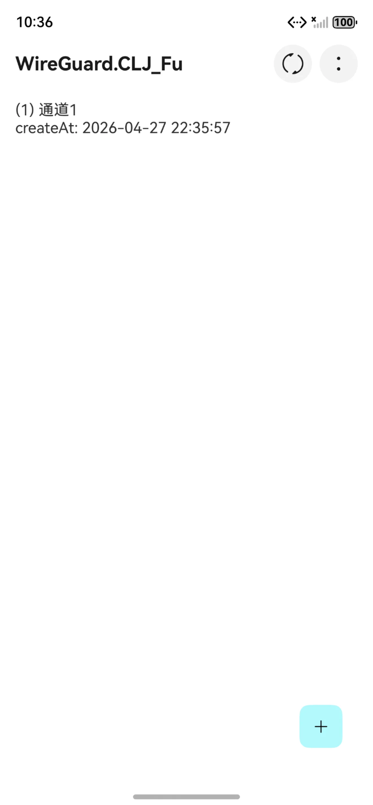

# 使用指南

> 从安装到组网的完整操作步骤。所有截图均为鸿蒙实机截图。

## 1. 安装与启动

<!-- wg-media -->

在[华为应用市场](https://appgallery.huawei.com/app/detail?id=site.leojay.wireguard&channelId=SHARE&source=appshare)搜索 **WG-VPN** 并安装。打开应用后进入启动页：

## 2. 添加配置

<!-- wg-media-start -->

进入主页（隧道列表），点击右下角 **+** 按钮，弹出导入菜单，支持三种方式：

### 2.1 导入配置（文件 / zip）

- 选择 **导入配置**，从本地文件导入。
- 支持导入**官方 WireGuard App 导出的 zip 备份文件**，免去手动填写的麻烦。

### 2.2 扫描二维码添加

- 选择 **扫描二维码添加**，扫描对方提供的 WireGuard 配置二维码即可自动生成隧道。

<!-- wg-media-end -->

### 2.3 手动添加

<!-- wg-media-start -->

选择 **手动添加**，进入创建隧道界面：

按需要填写以下内容：

- **名称**：隧道名称，显示在主页列表。
- **本地（Interface）**
  - **私钥**：随机生成，右侧按钮可刷新；系统自动推导出**公钥**。
  - **局域网 IP 地址**：分配给本机（如 `10.0.0.2/24`）。
  - **监听端口**：默认随机。
  - **DNS 服务器**：可选。
  - **MTU**：默认自动。
- **应用过滤**：见[第 6 节](#6-应用过滤)。
- **1、远程（Peer）**
  - **公钥**：对端公钥（必填）。
  - **预共享密钥**：可选。
  - **连接保活间隔**：可选，通常不建议设置。
  - **对端**：对端地址，支持 IP 或域名。
  - **路由的 IP 地址（段）**：默认 `0.0.0.0/0` 表示拦截全部请求；目前仅支持 IPv4 段（如 `10.0.0.1/24`），请使用英文逗号分隔。

<!-- wg-media-end -->

填完名称后保存配置，列表会出现该隧道：

## 3. 启用 / 停用 VPN

主页每个隧道项都有一个**开关**，点击即可开启或关闭对应 VPN；也可进入配置后点击右上角开关：

VPN 连接成功后，手机**状态栏会出现钥匙图标**：

## 4. 查看 / 编辑配置

<!-- wg-media -->

点击任意隧道进入**预览界面**：

预览界面会完整展示：

- 本地（Interface）：名称、公钥、局域网 IP 地址、DNS 服务器等。
- 远程（Peer）：公钥、路由的 IP 地址（段）、对端、DNS 解析偏好、连接保活时间等。
- 若对端为**域名**，可点击 **解析测试** 查看当前网络环境下解析出的 IP。

编辑配置：在预览界面点击右上角**编辑**按钮（铅笔图标），返回与“创建隧道”一致的界面进行修改。

## 5. 应用过滤

<!-- wg-media -->

应用过滤用于让**指定的应用**走 VPN 隧道，其余应用不走（白名单），或反之（黑名单）。开启后选择**黑名单 / 白名单**，再添加应用的**包名**：

> **说明**：HarmonyOS 限制无法直接获取已安装应用列表，因此支持以下三种方式添加应用包名：

1. **从剪贴板获取**：长按应用 → 分享 → 复制该应用在应用市场的链接；回到配置界面点击“从剪贴板获取”。
2. **分享添加**：长按应用 → 分享 → 选择 WG-VPN 应用 → 选择配置后进行黑白名单/白名单加入。
3. **手动输入**：在配置界面开启应用过滤，选择黑白名单方式，点击“添加应用”，输入包名。

不需要的应用可点击右侧**删除按钮**移除，保存配置后生效。

## 6. 域名配置与 DNS 解析

<!-- wg-media -->

当“对端”填写的是**域名**（例如 `vpn.site`）时，界面会显示 **DNS 解析偏好**与**解析测试**：

- **DNS 解析偏好**：`默认 IPv4` / `优先 IPv6` / `强制 IPv6` / `强制 IPv4`。
- **解析测试**：手动触发，查看当前网络环境下解析到的 IP 地址，便于排查网络问题。

## 7. 导出 / 备份配置

<!-- wg-media -->

进入**设置** → **导出隧道配置**，可将全部配置导出为 **zip 文件**，保存到下载目录，用于备份或迁移。

## 8. 排序与显示

主页右上角 **⋮（更多）** 菜单提供列表排序与显示设置：

- **排序参数**：创建时间。
- **排序顺序**：正序 / 倒序。
- **显示信息**：详细（显示创建时间）或简略。

## 9. 常见问题（FAQ）

**Q：为什么导出 / 导入的是 zip 文件？**
A：zip 是官方 WireGuard 通用的备份格式，便于在 WG-VPN 与官方 App 之间迁移配置。

**Q：应用过滤无法列出全部应用？**
A：HarmonyOS 平台限制无法获取应用列表，需按[第 5 节](#5-应用过滤)中的分享 / 剪贴板 / 手动方式添加包名。

**Q：应用过滤为什么需要手动输入包名？**
A：因为 HarmonyOS 官方不支持第三方应用获取应用列表，应用无法通过“选择应用列表”来直接取得包名。为此作者提供了 **分享**、**从剪贴板获取** 两种方式获取包名，同时支持 **手动输入**。详见[第 5 节](#5-应用过滤)。

**Q：连接后手机无法上网？**
A：检查“路由的 IP 地址（段）”是否正确，以及对端是否可达；域名类配置可先“解析测试”。

**Q：如何反馈问题或建议？**
A：参见 [意见反馈](意见反馈.md)。
