# 功能说明

> 本文档对 WG-VPN 的功能模块进行拆解，所有截图均为**鸿蒙实机截图**。
> 原始功能说明见仓库 `docs/WG-VPN功能说明.md`（本 docsify 站点之外），实机截图原图存放于 `docs/wg-vpn/screens/`。

## 模块总览

| 模块 | 说明 | 截图 |
| --- | --- | --- |
| 启动页 | 品牌 Logo，进入应用前的展示页 | [splash](#2-启动页) |
| 主页（隧道列表） | 配置列表、开关、排序、刷新、设置、更多 | [home](#3-主页隧道列表) |
| 配置导入 | 三种导入方式 | [import](#4-配置导入) |
| 创建/编辑隧道 | 本地(Interface) + 远程(Peer) + 应用过滤 + 域名解析 | [create](#5-创建--编辑隧道) |
| 配置预览 | 配置详情与 VPN 启停 | [detail](#6-配置预览) |
| 设置 | 导出配置、默认过滤模式、开发者选项、关于 | [settings](#7-设置) |
| 连接状态 | 状态栏钥匙图标 | [vpn](#8-连接状态) |

## 1. 定位与背景

基于 WireGuard 协议实现的 VPN 项目，用于跨网络加密安全组网。技术核心是使用 C++14 跨平台重新实现 WireGuard 协议栈，解决官方 C/Go 实现难以接入 HarmonyOS 的问题。

## 2. 启动页

<!-- wg-media -->

进入应用时展示品牌 Logo（蓝色背景 + 白龙标识）：

## 3. 主页（隧道列表）

配置列表页是应用的核心入口，每个隧道项显示**名称**与**开关**：

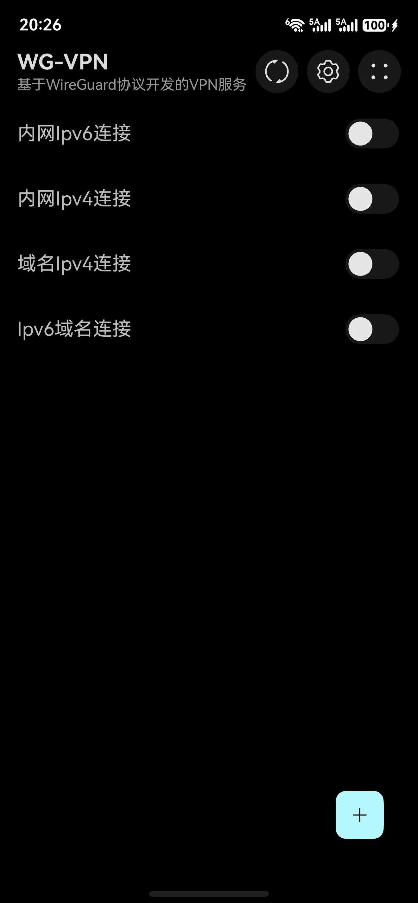

- **右上角**：刷新、设置、更多（排序与显示设置）。
- **右下角**：**+** 按钮，用于添加/导入配置。
- **空态**：无任何配置时显示“快来添加一个新配置吧”。

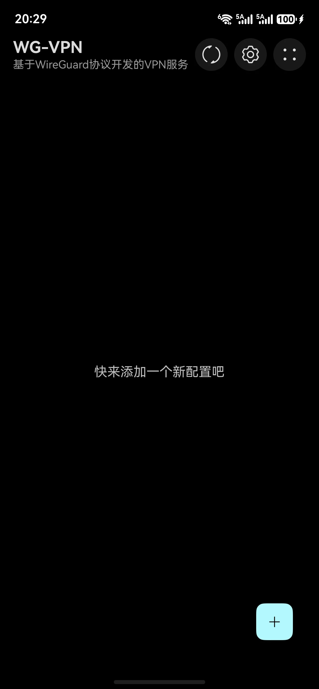

**排序与显示**：点击右上角 **⋮** 打开菜单，可设置：

- 排序参数：创建时间
- 排序顺序：正序 / 倒序
- 显示信息：**详细**（显示创建时间）/ **简略**

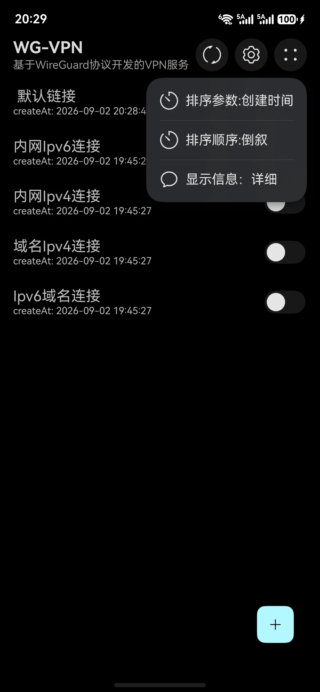

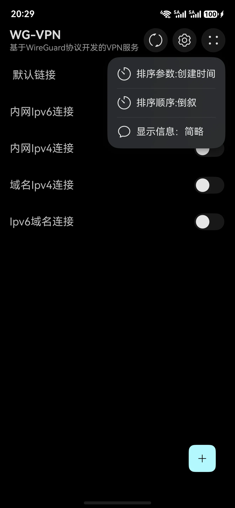

## 4. 配置导入

<!-- wg-media -->

点击右下角 **+**，弹出三种导入方式：

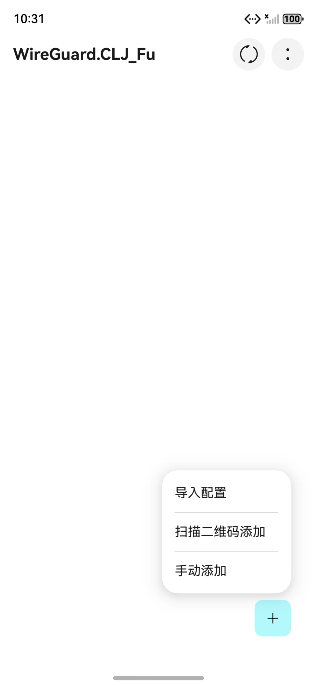

| 方式 | 说明 |
| --- | --- |
| **导入配置** | 从本地文件导入，支持官方 WireGuard 导出的 zip 备份 |
| **扫描二维码添加** | 扫码自动生成隧道 |
| **手动添加** | 手动填写 Interface 与 Peer |

## 5. 创建 / 编辑隧道

新增与修改共用同一界面，主要包括**本地（Interface）**与**远程（Peer）**两部分：

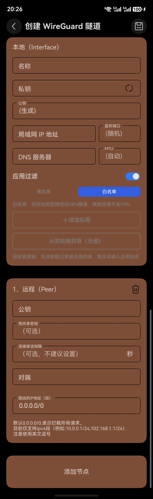

### 本地（Interface）

- **名称**：隧道名称。
- **私钥**：随机生成（右侧按钮刷新），系统自动推导公钥。
- **局域网 IP 地址**：如 `10.0.0.2/24`。
- **监听端口**：默认随机。
- **DNS 服务器**：可选。
- **MTU**：默认自动。

### 应用过滤

开启后可配置**黑名单 / 白名单**（二者只能配一个）：

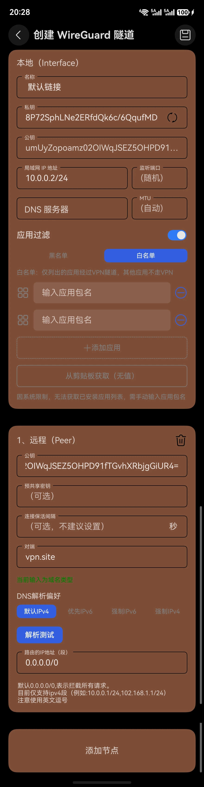

- HarmonyOS 无法获取应用列表，故通过**剪贴板 / 分享 / 手动输入**三种方式添加包名。
- 白名单：仅列出的应用经过 VPN 隧道，其他应用不走 VPN。
- 支持“从剪贴板获取”和“添加应用”。

### 远程（Peer）

- **公钥**：对端公钥（必填）。
- **预共享密钥**：可选。
- **连接保活间隔**：可选，通常不建议设置。
- **对端**：对端地址，支持 IP 或域名。
- **路由的 IP 地址（段）**：默认 `0.0.0.0/0`；目前仅支持 IPv4 段，使用英文逗号分隔。

### 域名类型与 DNS 解析

当“对端”填写域名时，界面会出现 **DNS 解析偏好**与**解析测试**，并提示“当前输入为域名类型”：

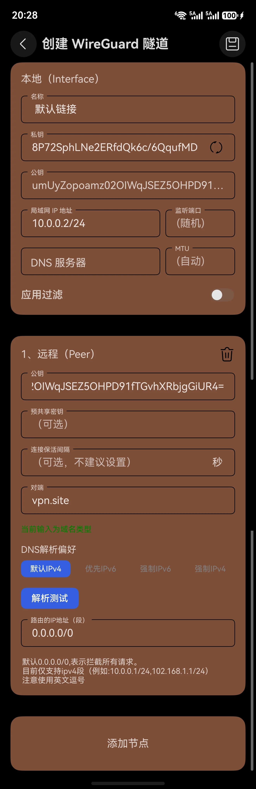

- **DNS 解析偏好**：`默认 IPv4` / `优先 IPv6` / `强制 IPv6` / `强制 IPv4`。
- **解析测试**：手动查看当前网络环境下解析出的 IP。

## 6. 配置预览

<!-- wg-media -->

点击列表项进入预览界面，展示本地与远程信息，可直接开启/关闭 VPN：

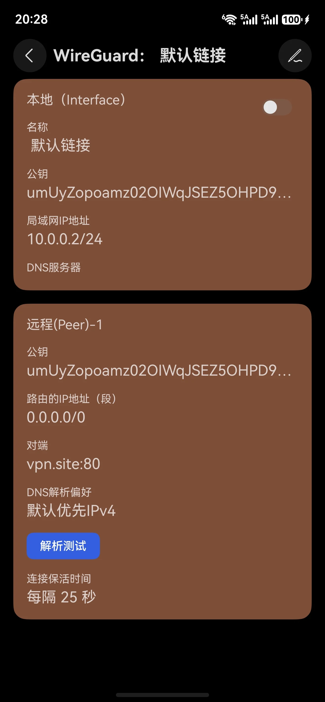

预览界面支持：

- 开启/关闭 VPN（右上角开关，或列表页开关）。
- 查看对端 IP / 端口、连接保活时间等。
- 域名类配置可**解析测试**查看解析 IP。
- 右上角编辑按钮进入修改。

## 7. 设置

<!-- wg-media -->

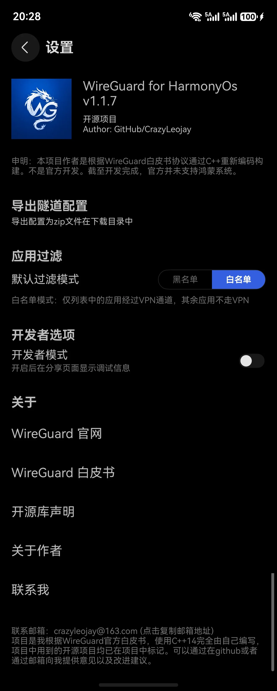

- **导出隧道配置**：导出为 zip 文件到下载目录，用于备份。
- **应用过滤 · 默认过滤模式**：默认黑名单 / 白名单。
- **开发者选项 · 开发者模式**：开启后分享页显示调试信息。
- **关于**：WireGuard 官网、白皮书、开源库声明、关于作者、联系我。
- **联系邮箱**：`crazyleojay@163.com`。

> 设置页还展示版本号（如 `v1.1.7`）、开源状态与作者信息，以及合规声明。

## 8. 连接状态

<!-- wg-media -->

连接成功后手机**状态栏会出现钥匙图标**，表示 VPN 已生效：

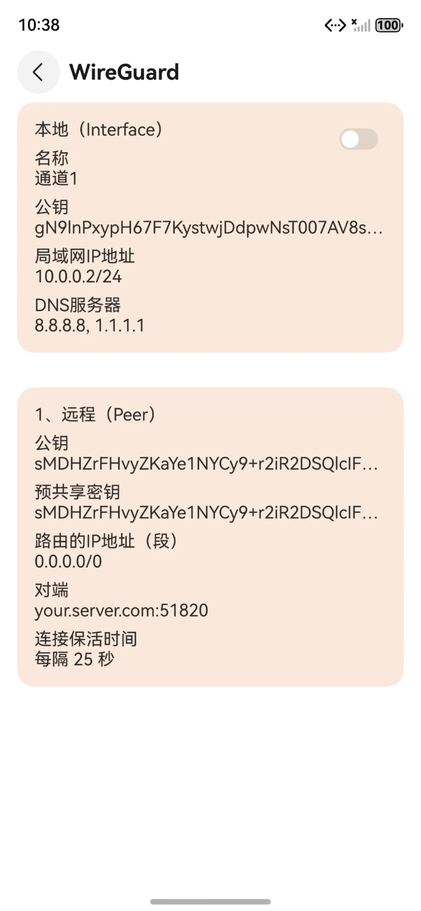

## 9. 删除配置

在主页向左滑动列表项，可触发删除：

- **滑动露出删除按钮**：点击删除。
- **持续左滑**：显示“松开删除”，松手即删除。

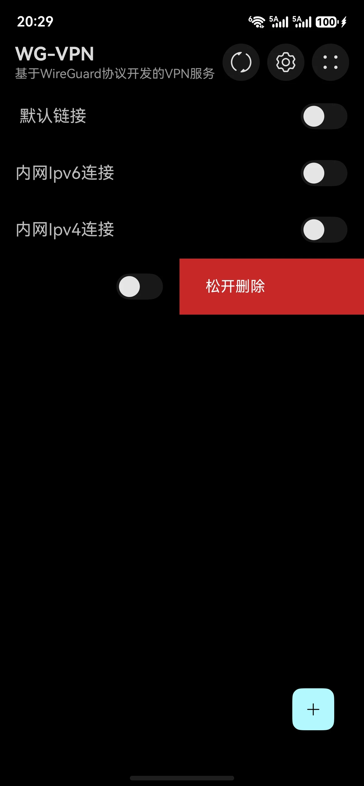

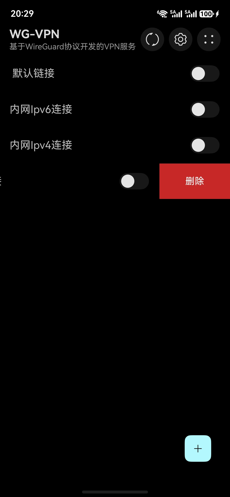

---

*界面与功能以实际版本为准，本页截图来自 v1.1.7。*
